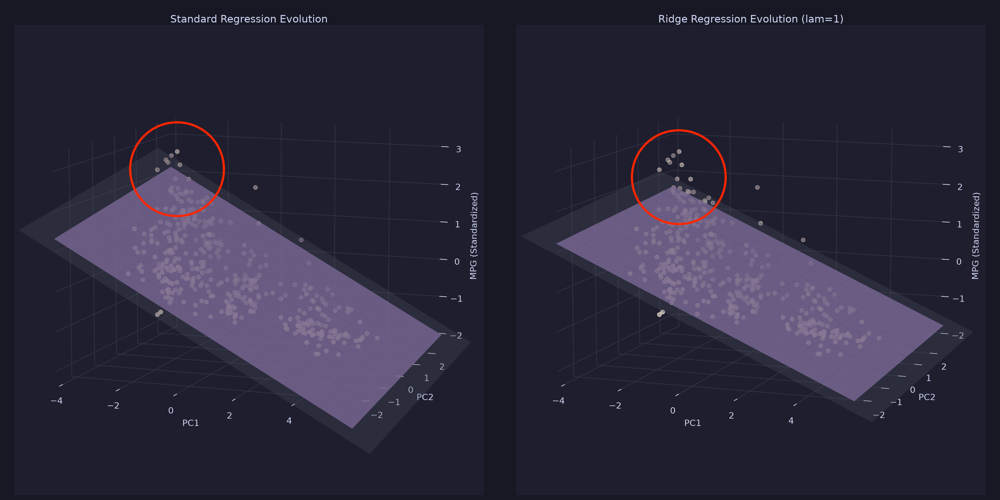

# Linear & Ridge Regression from Scratch

This project implements Linear Regression and Ridge (L2-regularized) Regression from scratch, comparing gradient descent optimization with exact analytical solutions. It evaluates performance using train/test splits and cross-validation, and provides a 3D visualization of the optimization landscape and fitting process using PCA.

---

## Reflection & Visual Exploration

### Optimization Evolution

*The gray plane represents the analytical result (theoretical optimum), and the pink plane represents the gradient descent evolution.*

This was meant to be an exploration into linear regression. I compared an objective function paired with gradient descent to the analytical methods that are relatively unique to linear regression. I also compared standard regression with ridge regression. The specific output meant to be predicted from the data was the fuel consumption of cars given their engine features (horsepower, displacement, etc.).

I felt like using different testing methods so I tested the algorithms in 2 ways: 80/20 training/testing split, and k-fold cross validation. Below are the results:

```
Training/testing regression and ridge regression models using 80/20 split:
Splitting and standardizing the data...
Training the models...
Using mean square error as evaluation metric:
Regression MSE: 0.15519779893020597
Ridge Regression MSE: 0.15356242937597964

Training/testing regression and ridge regression models using k-fold cross-validation:
This may take a second...
Average Regression MSE: 0.21064526488414853
Average Ridge Regression MSE: 0.20753311291741103

Analytical regression MSE: 0.19074471096160683
Analytical ridge regression MSE: 0.1912898933590121
```

As you can see ridge regression had a lower mean square error than normal regression in both the 80/20 split and cross validation. This implies that ridge regression does in fact generalize better than standard regression. This lends validity to the regularization term that characterizes ridge regression. As far as this dataset is concerned, it is helpful to see how/why the regularizer term changed how well ridge regression performed.

### Effects of Regularization on Outliers


*(Note: even though it looks like the data is entirely underneath the planes this is just an artifact of matplotlib. The plane object is just drawn directly top of the data points without accounting for height discrepancies)*

As I have circled in the above image, there is a cluster of points at the top of the graph that seem to be slight outliers. As you can see, the standard regression plane tilts more to accommodate these points than the ridge regression plane. Having a regularizer term there to make the model more suspicious of emerging patterns made a tangible difference on this dataset. This serves as a nice visual example for the underlying results and data.

---

## Theory & Mathematical Background

### 1. Ordinary Linear Regression
Linear regression models the relationship between a dependent variable $y$ and independent variables $X$ using a linear combination of weights $\theta$:
$$\hat{y} = X\theta$$

*   **Objective Function (Mean Squared Error):**
    $$J(\theta) = \frac{1}{n} \|X\theta - y\|^2$$
*   **Gradient:**
    $$\nabla_{\theta} J(\theta) = \frac{2}{n} X^T (X\theta - y)$$
*   **Analytical Solution (Ordinary Least Squares):**
    $$\theta = (X^T X)^{-1} X^T y$$

### 2. Ridge Regression (L2 Regularization)
Ridge regression introduces a regularization parameter $\lambda$ to penalize large weights, preventing overfitting. Crucially, the bias term (the last element of $\theta$) is **not** regularized.

Let $\tilde{\theta}$ be equal to $\theta$, except the bias term $\theta_d$ is replaced with $0$.
*   **Objective Function:**
    $$J_{ridge}(\theta) = \frac{1}{n} \|X\theta - y\|^2 + \lambda \|\tilde{\theta}\|^2$$
*   **Gradient:**
    $$\nabla_{\theta} J_{ridge}(\theta) = \frac{2}{n} X^T (X\theta - y) + 2\lambda\tilde{\theta}$$
*   **Analytical Solution:**
    $$\theta = (X^T X + n\lambda I_{mod})^{-1} X^T y$$
    where $I_{mod}$ is the identity matrix with the last diagonal element set to $0$.

---

## Repository Structure

*   [helpers_regression.py](file:///Users/bogiekissiov/Desktop/regression-practice/helpers_regression.py): Implements core formulas: MSE/Ridge objective functions, gradient functions, gradient descent loop, and analytical solvers.
*   [analysis_regression.py](file:///Users/bogiekissiov/Desktop/regression-practice/analysis_regression.py): Standardizes data, trains/evaluates the models on the `auto-mpg` dataset via 80/20 splits and 10-fold cross-validation.
*   [visualization_regression.py](file:///Users/bogiekissiov/Desktop/regression-practice/visualization_regression.py): Performs PCA dimension reduction to 2D features for a 3D matplotlib animation showing the gradient descent plane converging to the analytical plane.
*   `auto-mpg.csv`: The cleaned vehicle fuel efficiency dataset containing features like cylinders, displacement, horsepower, weight, and acceleration.

---

## Installation & Setup

1.  **Clone or navigate** to the project directory:
    ```bash
    cd /Users/bogiekissiov/Desktop/regression-practice
    ```
2.  **Create and activate** a virtual environment:
    ```bash
    python3 -m venv venv
    source venv/bin/activate
    ```
3.  **Install dependencies**:
    ```bash
    pip install numpy pandas matplotlib scikit-learn catppuccin pillow
    ```

---

## Usage

### Run the Evaluation Pipeline
Execute [analysis_regression.py](file:///Users/bogiekissiov/Desktop/regression-practice/analysis_regression.py) to train the models and output metrics for the 80/20 train/test split, 10-fold cross-validation, and analytical baselines:
```bash
python analysis_regression.py
```

### Generate 3D Optimization Animation
Execute [visualization_regression.py](file:///Users/bogiekissiov/Desktop/regression-practice/visualization_regression.py) to run standard and Ridge gradient descent on the PCA-reduced data and generate a GIF showing the plane fitting evolution over time:
```bash
python visualization_regression.py
```
This saves the result to `regression_comparison.gif` in the root directory.
